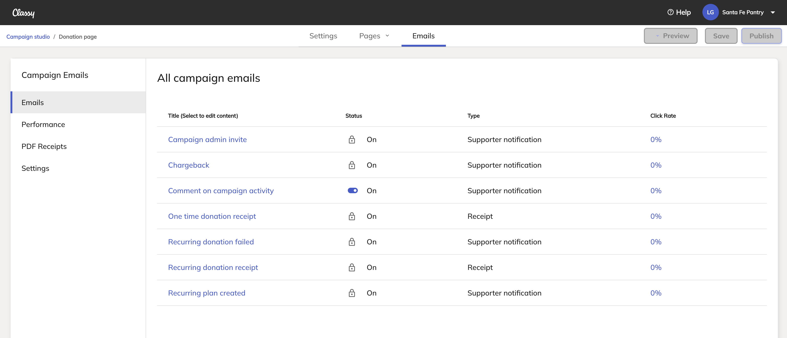

# Emails

Email Studio is the one-stop solution for writing, managing, and delivering emails for your fundraising campaign. This versatile tool elevates the communication experience, enhancing your interaction with donors and supporters while ensuring your messages reflect your brand.

To access Email Studio, select the **Emails** tab in Campaign Studio.

## Navigate emails

From the **Emails** tab, you’ll find a list of default campaign emails. Each email has the status (on/off), the type, and the click rate for that message.

Default campaign emails include:

- Campaign admin invite
- Chargeback
- Comment on campaign activity
- One-time donation receipt
- Recurring donation failed
- Recurring donation receipt
- Recurring plan created

Select an email’s title to open the builder and edit the message. Select the toggle to turn on/off specific messages and select a message’s Click Rate to view additional metrics.

## Edit and preview emails

Select an email’s title to go to the drag-and-drop builder for that message. Within the builder, you’ll find similar tools available in Campaign Studio:

- Drag-and-drop sections, headings, paragraphs, buttons, and images
- Ability to customize the logo and style of your header
- Ability to add, remove, and position custom widgets

The Email builder differs from Campaign Studio in a couple of important ways:

- A single, 1-section blank layout for the initial launch
- A selection of limited, email-safe fonts
- Email-specific widgets such as **Contact Us** and **Manage Donation**

### Add dynamic content (Smart Variables) to emails

During Early Access, we’ll provide a list of variables you can copy and paste into each email to dynamically populate data, such as recipient name, transaction amount, etc.

Later, we’ll update these settings to allow you to select these values from within the email and PDF receipt builders.

### Show or hide custom questions in emails

To show or hide custom questions in emails:

1. From the **Emails** menu, select a receipt email
2. Select the transaction table
3. In the editor, turn on or off the **Show questions** toggle

### Show or hide Contact details in the email’s footer

To show or hide Contact details in an email’s footer

1. From the Emails menu, select the email you want to edit
2. Select the email’s footer
3. In the editor, turn on or off the **Show contact us** toggle

### Show or hide Manage Your Donation in an email’s body

To show or hide Manage Your Donation in an email’s body:

1. From the Emails menu, select the email you want to edit
2. Select the email’s footer
3. In the editor, turn on or off the **Manage Your Donation** toggle
