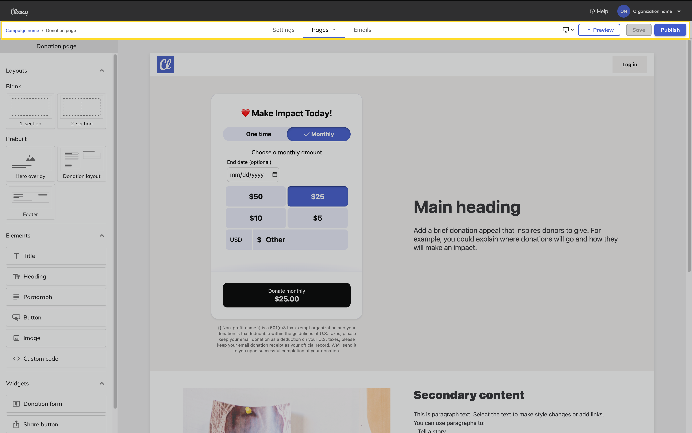
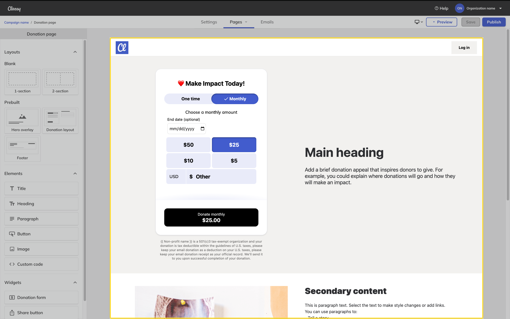
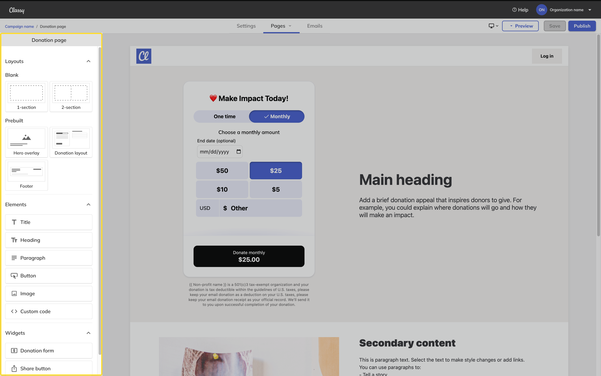

# Intro to Campaign Studio

<iframe src="https://fast.wistia.net/embed/iframe/mny80k51o3?seo=true&videoFoam=true" title="Introduction to Campaign Studio Video" allow="autoplay; fullscreen" allowtransparency="true" frameborder="0" scrolling="no" class="wistia_embed" name="wistia_embed" msallowfullscreen width="100%" height="100%"></iframe>

Campaign Studio lets you build your campaign’s layout, design the look and feel of your pages, and add text, buttons, images, and custom code to create a donation page fit for your needs.

In Campaign Studio, you can add or delete sections, drag and drop elements, and place widgets such as a donation form or FAQ where you need them.

In this article, you’ll learn how to:

- [Access Campaign Studio](#access-campaign-studio)
- [Navigate Campaign Studio](#navigate-campaign-studio)

!!! example "Want to participate?"

    <a href="https://learn.classy.org/campaign-studio-early-access-sign-up.html">Sign up</a> to join the waitlist for Campaign Studio.

## Access Campaign Studio

To access Classy’s Campaign Studio for the first time, you need to create a new campaign.

If you already have a Campaign Studio campaign, you can access Studio again by going to the campaign and selecting **Edit Campaign**.

### Create a campaign

To create a campaign using Studio:

1. In the menu, select **Campaigns**
2. Select **Create new campaign**
3. Choose **Campaign Studio**
4. Select **Create**

!!! note

    Campaign Studio is only available for donation pages. We’re currently working on making it available for all campaign types.

#### Choose a starting point

To help you get started, choose a starting layout for your campaign.

- **Donation form above the fold** - Best for high-converting pages. A donation form appears without the need to scroll down the page.
- **Hero image** - Ideal balance between text and imagery. Pair an appeal with an engaging image to draw in supporters.
- **Full hero image** - A captivating full-screen image tells a story through impactful visuals and layered text

#### Enter the campaign details

Then, enter some basic information about your campaign, such as:

- Campaign name\*
- Internal event name
- Campaign short URL
- Fundraising Goal\*
- Default designation

*Required

#### Apply your brand

Finally, apply your brand. The options include:

- Adding a Header logo and link
- Setting the default font for headings, paragraphs, and buttons
- Setting the primary and secondary colors

Once you create your donation page, you’ll land in Campaign Studio, where you can build and customize the rest of your campaign.

## Navigate Campaign Studio

Campaign Studio’s designer consists of the navigation menu, the canvas, and the editor.

### Navigation menu

The navigation menu appears at the top of the page. It includes:

- Settings
- Pages
- Emails
- Preview
- Save and Publish

Select **Settings**, **Pages**, and **Emails** to navigate through Campaign Studio and customize each part of your campaign.

When ready, you can preview the pages, save your work, and publish your campaign before sharing it with your community.

!!! note

    Campaign Studio allows you to view and edit your campaign pages in three different views, Desktop, Tablet, and Mobile. To switch between these views, select the **desktop icon** in the  navigation menu.

### Pages

Pages provide the canvas and editor to preview, build, and design your campaign. To switch to a different page, select the **Pages** tab and choose the page you want to edit.

#### Canvas

The canvas previews the supporter-facing page. You can select blocks, drag and drop them to move them around, and edit the content directly on the page.

#### Editor

The editor is how you’ll add new content to the page, including layouts, elements, and widgets. When you select a block in the canvas, the editor will update to show your tools and options.

[Learn more about the designer](intro-to-the-designer.md)

### Settings

Settings provide the basic details of your campaign and other options, including custom questions. Use the **Settings** tab to find options for setting up and customizing your supporter’s experience.

[Learn more about campaign settings](settings.md)

### Emails

Emails provide the tools to customize your campaign’s automated emails, view email performance, customize receipts, and other email-specific settings.

[Learn more about email settings](email-studio.md)

### Save and publish

Campaign Studio breaks saving and publishing into two separate actions. When you **Publish** a campaign, that campaign is made available on the web to your supporters.

You can also **Save** a campaign at any time. Saved changes will only appear on the **Published** version of the campaign. You can view saved changes in your browser's window by selecting Preview in the navigation menu.

!!! question "Have feedback?"

    Let us know! [Fill out this form](https://classy.typeform.com/to/h4B8FgwI) to report issues, make requests, or share positive notes.
