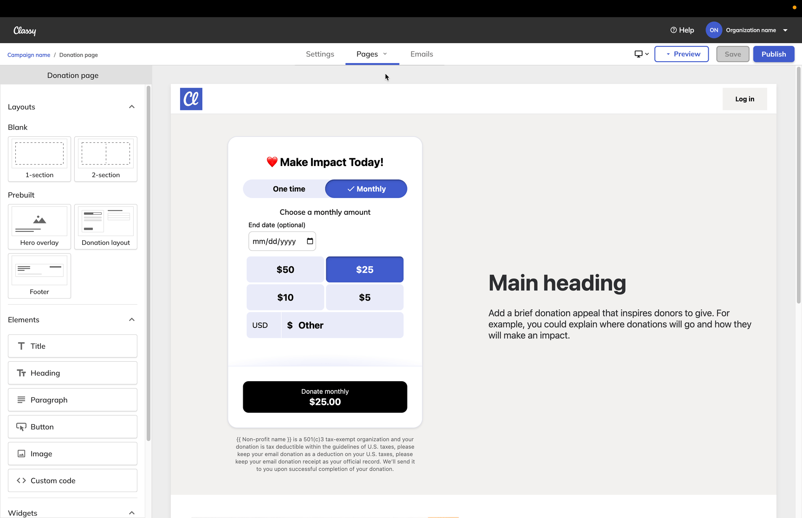

# Designer

<iframe src="https://fast.wistia.net/embed/iframe/fbu1uxzhk4?seo=true&videoFoam=true" title="Campaign Studio's Designer Video" allow="autoplay; fullscreen" allowtransparency="true" frameborder="0" scrolling="no" class="wistia_embed" name="wistia_embed" msallowfullscreen width="100%" height="100%"></iframe>

Campaign Studio’s designer lets you build your campaign’s layout, design the look and feel of your pages, and add text, buttons, images, and custom code to create a donation page fit for your needs.

In Campaign Studio, you can add or delete sections, drag and drop elements, and place widgets such as a donation form or FAQ where you need them.

## Add, remove, or move blocks

You can add sections and elements to your canvas by dragging and dropping them from the editor to your canvas. To move or remove blocks, you’ll need to hover over the element or section and select the appropriate icon.

### Add blocks

Add layouts, elements, and widgets to your canvas by dragging and dropping the block from the editor to the canvas.

### Remove blocks

Remove sections, elements, or widgets by selecting the block you want to remove and then selecting the trash can icon.

!!! tip

    Confirm you’re removing the right element or section by viewing the tab that appears when hovering over the block.

### Move blocks

Move a section, element, or widget to another part of the canvas by hovering over the block, selecting the drag icon (six dots at the top), and dragging it to its new location.

## Layouts

Layouts are either blank or pre-built sections you can drag and drop onto the canvas. Once on the canvas, you can add elements or widgets to the sections. All layouts span across the full width of the page.

### Blank layouts

Blank layouts consist of 1-section or 2-section layouts. These layouts do not include any elements or widgets.

#### 1-section

Use a 1-section layout to stack elements or widgets on top of each other.

#### 2-section

Use a 2-section layout to set elements and widgets side-by-side.

### Prebuilt layouts

Prebuilt layouts include a Hero overlay, a Donation layout, and a Footer. These layouts have some elements and widgets by default. Once added, you can adjust these layouts to fit your needs.

#### Hero overlay

The hero overlay is a 2-section layout with separate background images and a left-aligned title and paragraph element.

#### Donation layout

The donation layout is a 2-section layout with a donation form, share button, and FAQ widget. It also includes a header and paragraph element.

#### Footer

The footer layout can only be added to the bottom of the page. It includes information about your organization, including the name, address, contact information, and social links.

Use the editor to style the background color and opacity of the section. Also, select the **Configure** tab to edit the logo and social links that appear.

## Elements

Elements are the page's content, including text, buttons, and images. You can add elements to sections of your page by dragging and dropping them onto the canvas.

The full list of elements includes:

- Title
- Heading
- Paragraph
- Button
- Image
- Custom code

### Title

Title elements are a large header that can improve search result rankings and accessibility. We recommend using only a single Title element near the top of your page.

### Heading

Heading elements are another header that appears smaller than the title element. Use these to introduce additional paragraph content.

### Paragraph

Paragraph elements consist of the main text on your page. We recommend placing paragraph elements below a title or heading element.

### Button

Button elements can link supporters to another campaign or an external page. Once added, you can adjust the button’s label, alignment, color, and border.

### Image

Image elements are placeholders you can use to upload images to show on your campaign’s page. Note that these are separate from background images for sections.

Images can be JPG, PNG, or GIFs and must be smaller than 2 MB.

Once added, you can adjust the image’s overlay (a color added on top of an image) and its border.

### Custom code

Custom code elements let you add HTML and CSS to your campaign’s pages (Javascript is not supported). When added to your page's canvas, these full-width elements create a new section.

## Widgets

Widgets are advanced elements with specific use cases and features built-in. You can add widgets just like other blocks by dragging and dropping them onto the canvas.

The full list of widgets includes:

- Donation form
- Share button
- FAQ

### Donation form

Supporters can use the donation form to contribute to your campaign. Once added to the canvas, you can customize the heading, the tax-deductible message at the bottom, the donation frequencies, and donation amounts.

!!! tip

    For a recurring donation campaign, turn off One-time donations and let supporters choose their preferred donation frequency.

### Share button

The share button lets supporters share your campaign via social media, email, or text. When someone selects your Share widget, a pop-up appears to share your campaign via the methods you allow.

Once added to the canvas, you can customize the heading and sub-heading that appears in the pop-up, the options that appear, and the style of the button.

To edit the default messages used for sharing, visit your campaign’s [settings](settings.md).

### FAQ

The FAQ widget lets you add frequently asked questions to your campaign’s pages to reassure supporters. Once added to the canvas, you can customize the widget’s questions and answers.
